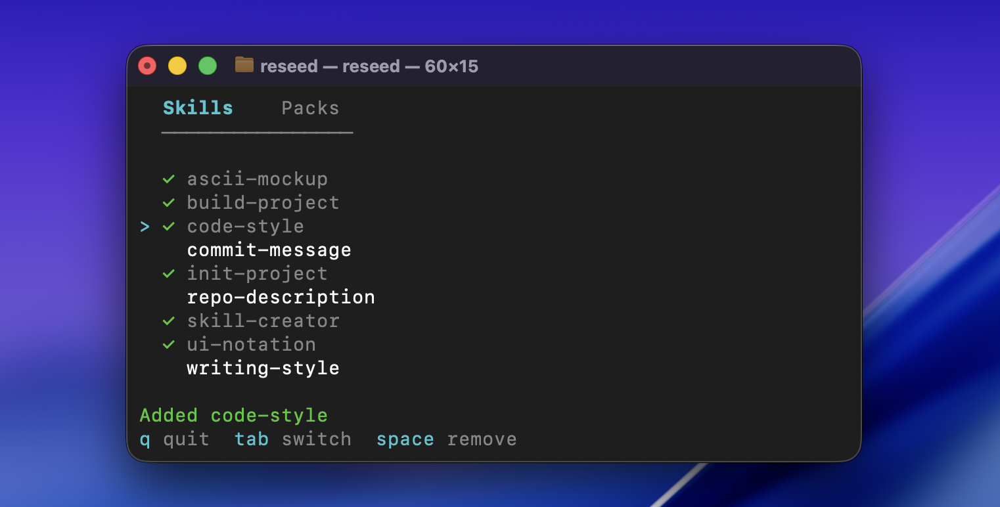

<p align="center">
  
</p>

<p align="center">
  A CLI tool for managing and distributing <a href="https://agentskills.io">agent skills</a> across projects
</p>

<p align="center">
  <a href="https://reseed.mintlify.app"></a>
  <a href="https://github.com/nattergabriel/reseed/blob/main/LICENSE"></a>
  <a href="https://github.com/nattergabriel/reseed/actions/workflows/ci.yml"></a>
</p>

---

Reseed manages your [agent skills](https://agentskills.io) across projects. Keep all your skills in one central library, pull in open source ones from GitHub, and install exactly what each project needs. Instead of global skills that bloat every project, skills live in each project so every teammate has access. Your library can be a git repo to version and share your collection.

## Install

**macOS and Linux:**

```bash
curl -fsSL https://raw.githubusercontent.com/nattergabriel/reseed/main/install.sh | sh
```

**Windows:** download the binary from the [latest release](https://github.com/nattergabriel/reseed/releases/latest) and add it to your PATH.

## Getting started

Your **library** is a directory where all your skills live. It can be any folder on your machine (and can itself be a git repo to version and share your collection). From there, you install skills into any project's `.agents/skills/` directory.

### 1. Create your library

This only needs to be done once.

```bash
reseed init ~/skills
```

### 2. Add skills to your library

Write your own skills (any folder with a `SKILL.md` file) or pull in open source ones from GitHub. Use `--pack` to group related skills together.

```bash
reseed install anthropics/skills/skills --pack anthropic
```

### 3. Browse and manage your library

Running `reseed` without any args opens an interactive TUI where you can browse your skills and packs, and add or remove them from the current project.

<p align="center">
  
</p>

### 4. Keep things up to date

Re-copy the latest versions of your library skills into a project:

```bash
reseed sync
```

### CLI commands

All operations available in the TUI also work as standalone commands for scripting and automation:

```bash
reseed add <skills...>  # add skills or packs to the project
reseed remove <skills...>  # remove skills from the project
reseed list  # list library contents
reseed status  # show skills installed in the project
```

For the full walkthrough, see the [quickstart guide](https://reseed.mintlify.app/quickstart). Browse the [docs](https://reseed.mintlify.app) for details on every command.

## Contributing

Requires Go 1.24+ and [golangci-lint](https://golangci-lint.run/). Run `make setup` to enable pre-commit hooks.

## License

[MIT](LICENSE). Free to use, modify, and distribute.
